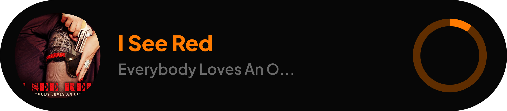

# Courage-THE DISCORD BOT 

  
  <h2>Advanced Discord Music Bot with Lavalink</h2>
  
A feature-rich Discord music bot that supports multiple music platforms and languages

## 🎵 Features

- High-quality music playback using Lavalink
- Multi-platform support:
  - YouTube
  - SoundCloud
  - Spotify
- Support for links, text searches, and playlists
- Roast command with savage comebacks
- Easy setup and configuration

## 📋 Commands Of Bot

- `/play` - Play music from YouTube, SoundCloud, or Spotify
- `/roast` - Roast a user with a savage comeback
- More commands available in the commands directory

## 🧰 Technologies Used

- Discord.js v14
- Lavalink
- MongoDB
- Node.js
- Express

## 👨‍💻 Developer

**VAIBHAV PATEL**

## 📄 License

This project is licensed under the terms specified in the LICENSE file.

## 🔗 Support

For support, join our [Discord server](https://discord.gg/s2cmhgW)
